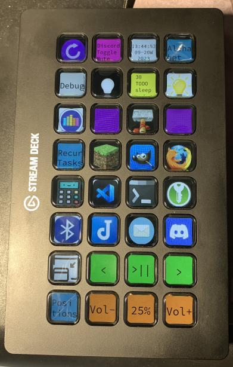

# vsdlib
A python framework for easily creating a custom Stream Deck user interface

VSDLib makes it easier to customize button appearance (image, or text+background color), create structured layouts, multiple pages.

VSDLib is short for "violet stream deck library".

[violet_streamdeck](https://github.com/violet4/violet_streamdeck) is a program that demonstrates the use of vsdlib.



# Getting Started

```toml
# example.toml

# custom colors that can be referenced by name
[colors]
light_pink='#f77'

[c0.r0]
# the button will display the text "g"
text="g"
# reference to `light_pink` from the `colors` section above
color='light_pink'

# press a keyboard character, perform a hotkey, or type something
button_schema_classes="PressButtonSchema"
# when pressed, the button will type the character "g"
key="g"
# delay this many seconds (some applications require a "firm" key press)
delay=0.1
```

See more examples in [example.toml](example.toml).

Add `vsdlib` as a dependency to your project.

The recommended method us by using [`python poetry`](https://python-poetry.org/docs/basic-usage/):

    # requires that you have a github ssh key set up
    poetry add git+ssh://git@github.com/violet4/vsdlib.git

Then you can run from a toml file with:

`poetry run vsdlib example.toml`

# Architecture

## TODO: Diagram Goes Here

Classes:

* Board
    * BoardLayout
    * SubBoardLayout
* Button
* ButtonStyle
* ButtonSlot
* Image - doesn't exist but should exist to pull out the button image handling like rotation/dimming/toggling etc
* Widget
